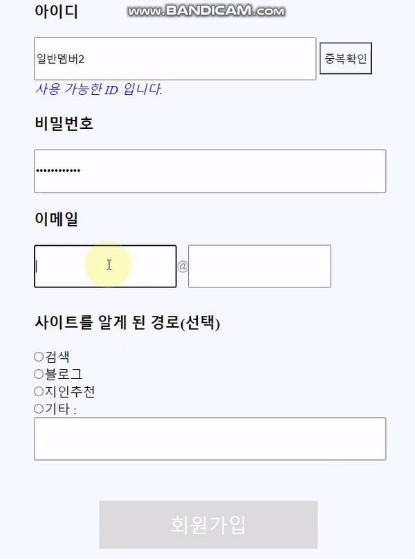

# 개발학습 플랫폼 '디공' 개발 프로젝트

  ### :loudspeaker: 개요
  

* #### 제작 의도

    개발자로서 학습을 위해 이용할 수 있는 다양한 플랫폼 웹 사이트들과 자료가 있지만, 필요한 자료가 있을 때마다 이 모든 사이트들에 한 번씩 방문하여 확인을 해야하는 번거로움이 있다.
    
    
    
    이러한 문제의식에서 출발하여 학습하려는 언어와 난이도, 학습 수단을 분류 기준으로 삼아 해당 자료들을 한 곳에 모았다. 이를 통해 **간편하게 하나의 사이트에서 원하는 학습 자료를 찾아보고 공부할 수 있어, 시간과 학습관리 측면에서 효율을 가져다주는 '디공' 서비스**를 제작하였다.
    
    
    
    여기서 '디공'이라는 서비스명은, 개발자 Developer에서 De를, 공부에서 공을 따와 이름지었다.
    
 

* #### 개발인원

   :raising_hand: 1명

* #### 개발기간

   2021년 11월 14일 - 2021년 12월 8일
   
   
 ### :loudspeaker: 사용한 기술
 
 
 * #### 프론트엔드

    HTML5, CSS3, ES6, JQuery
    
 
 
 * #### 백엔드

    Java, Spring Boot, MySQL 
    
    
 
 ### :loudspeaker: 구현 기능
  
 
 * #### 프론트엔드

    웹사이트 전체 UI(헤더, 푸터, 메인화면, 한눈에보기 화면, 선택지 화면, 게시판, 로그인 및 회원가입 화면), 선택지 알고리즘, 앵커, 콘텐츠 링크 연결 기능 구현
    
 
 
 * #### 백엔드

    로그인, 회원가입, 페이징처리, Ajax를 이용한 아이디 중복확인, 이메일 가져오기, 게시판 글 불러오기⬝글쓰기⬝글 수정하기⬝글 삭제하기⬝답글쓰기, 페이징처리, 인터셉터를 통한 회원 구분, MySQL 연동 기능 구현 
    
    
 
 ### :loudspeaker: 핵심 기능
 
 
 #### 1) 선택 시 해당되는 결과 페이지로 이동(프론트엔드)
 
 
 
 아래처럼 총 3개의 질문을 거쳐 해당하는 결과 페이지(추천 학습자료 페이지)로 이동하게 된다.
 
 
 
 
        //버튼 클릭 시 다음페이지 이동
        button.addEventListener("click", function() {
          let link = window.location.href;
          if(link == "http://localhost:8080/common/ch1"){
            choice = $(this).attr('class');
            const a = {"a1" : choice};
            localStorage.setItem('a1', JSON.stringify(a));
            location.href="ch2";
          }else if(link == "http://localhost:8080/common/ch2"){
            choice = $(this).attr('class');
            const a = {"a2" : choice};
            localStorage.setItem('a2', JSON.stringify(a));
            location.href="ch3";
          }else {
            choice = $(this).attr('class');
            const a = {"a3" : choice};
            localStorage.setItem('a3', JSON.stringify(a));
            result();
          }
        })
  
        //결과 출력 후 해당 페이지로 이동
      function result() {
        const r1 = JSON.parse(localStorage.getItem('a1'));
        const r2= JSON.parse(localStorage.getItem('a2'));
        const r3= JSON.parse(localStorage.getItem('a3'));

        //선택된 결과
        const result = [r1.a1, r2.a2, r3.a3];

        //존재하는 결과들 14개
        const results = [
          ["0", "0", "0"], //0, 컴퓨터공학 기초 기본서
          ["0", "0", "1"], //1, 컴퓨터공학 기초 온라인 강의
          ["1", "0", "0"], //2, HTML/CSS 초급 기본서
          ["1", "0", "1"], //3, HTML/CSS 초급 온라인 강의
          ["1", "1", "0"], //4, HTML/CSS 중상급 기본서
          ["1", "1", "1"], //5, HTML/CSS 중상급 온라인 강의
          ["2", "0", "0"], //6, Javascript 초급 기본서
          ["2", "0", "1"], //7, Javascript 초급 온라인 강의
          ["2", "1", "0"], //8, Javascript 중상급 기본서
          ["2", "1", "1"], //9, Javascript 중상급 온라인 강의
          ["3", "0", "0"], //10, Java 초급 기본서
          ["3", "0", "1"], //11, Java 초급 온라인 강의
          ["3", "1", "0"], //12, Java 중상급 기본서
          ["3", "1", "1"], //13, Java 중상급 온라인 강의
        ];

        for(let i=0;i<14;i++){
          if(JSON.stringify(result) == JSON.stringify(results[i])){
            location.href="../result/"+i;
          }else {
          }	
        }
      }
 
 
 #### 2) '더 알아보기' JS 마우스 이벤트(프론트엔드)
 
 
   추천 자료들을 한 눈에 볼 수 있도록 선택지의 결과들을 한 페이지에 정리하였다.
   
   
   해당 페이지에서 항목에 마우스를 대면 '더 알아보기' 폰트가 나타나면서 이미지는 흐려지는 이벤트가 나타나며, 클릭 시 자세한 정보를 알 수 있는 페이지로 이동한다.
   
   
   
   
 
   HTML
   
   
   
                <ul>
                  <li>
                    <button class="button">
                      

                        <a href="https://www.aladin.co.kr/shop/wproduct.aspx?ItemId=141042179" target="_blank"><h5>더 알아보기</h5></a>
                      

                      <article class="contents">
                        
                         <h6>한 권으로 그리는 컴퓨터과학 로드맵</h6>
                      </article>
                    </button>
                  </li>
                  <li>
                    <button class="button">
                      

                        <a href="https://www.aladin.co.kr/shop/wproduct.aspx?ItemId=83064510" target="_blank"><h5>더 알아보기</h5></a>
                      

                      <article class="contents">
                        
                         <h6>다 함께 프로그래밍</h6>
                      </article>
                    </button>
                  </li>
                  <li>
                    <button class="button">
                      

                        <a href="https://www.aladin.co.kr/shop/wproduct.aspx?ItemId=268444562" target="_blank"><h5>더 알아보기</h5></a>
                      

                      <article class="contents">
                        
                         <h6>한 권으로 읽는 컴퓨터 구조와 프로그래밍</h6>
                      </article>
                    </button>
                  </li>
                </ul>
                
  JS
  
  
  
                
              const more = document.querySelectorAll(".more");
              const contents = document.querySelectorAll(".contents");
              const button = document.querySelectorAll(".button");

              for(let i=0;i<button.length;i++){
                button[i].addEventListener("mouseover", function(){
                    more[i].classList.remove("hidden");
                    contents[i].classList.add("opacity");
                })
              }

              for(let i=0;i<button.length;i++){
                button[i].addEventListener("mouseout", function(){
                  more[i].classList.add("hidden");
                  contents[i].classList.remove("opacity");
                })
              }
 
 #### 3) 게시판 답글 기능(백엔드)
 
 
 의견 게시판에서는 회원이 홈페이지에 추가를 요청하는 추천 자료를 게시글로 건의할 수 있는데,
 관리자가 이를 확인하여 답글을 작성할 수 있도록 답글 기능을 구현하였다.
 
 
 
 
 
 
 Controller
 
 
 
          //답글
          @GetMapping("reply")
          public String reply(@ModelAttribute QnaVO qnaVO) throws Exception {
            return "qna/reply";
          }

          @PostMapping("reply")
          public String reply(QnaVO qnaVO, BindingResult bindingResult, HttpSession session) throws Exception {
            MemberVO memberVO = (MemberVO)session.getAttribute("member");
            qnaVO.setWriter(memberVO.getId());
            int result = qnaService.setReplyInsert(qnaVO);
            return "redirect:../qna/list";
          }
          
    
    
 Service
 
 
 
        //답글
        public int setReplyInsert(QnaVO qnaVO) throws Exception {
          int result = qnaRepository.setReplyUpdate(qnaVO);
          result = qnaRepository.setReplyInsert(qnaVO);
          return result;
        }
        
        
        
 Repository
 
 
 
        //답글
        public int setReplyInsert(QnaVO qnaVO)throws Exception;
        public int setReplyUpdate(QnaVO qnaVO)throws Exception;
        public int setRefUpdate(QnaVO qnaVO)throws Exception;
        
        
        
 Mapper
 
 
 
        <insert id="setReplyInsert" parameterType="QnaVO" useGeneratedKeys="true" keyProperty="num">
          insert into destudyqna (num, title, contents, writer, hit, date, ref, step, depth)
          values (null, #{title}, #{contents}, #{writer}, 0, now(),
          (select R.ref from (select * from destudyqna where num=#{num}) R),
          (select S.step+1 from (select * from destudyqna where num=#{num}) S),
          (select D.depth+1 from (select * from destudyqna where num=#{num}) D)
          )
        </insert>

        <update id="setReplyUpdate" parameterType="QnaVO">
          update destudyqna set step=step+1
          where ref=(select R.ref from (select ref from destudyqna where num=#{num}) R)
          and
          step > (select S.step from (select step from destudyqna where num=#{num}) S)
        </update>

        <update id="setRefUpdate" parameterType="QnaVO">
          update destudyqna set ref=#{num} where num=#{num}
        </update>
 
 
 #### 4) 관리자와 일반회원 구분에 따라 접근 제한(백엔드)
 
 
 
 공지사항 게시판의 경우, 관리자만 글쓰기 및 글 수정하기, 글 삭제하기가 가능하다.
 
 
 
 공지사항 게시판에서 해당 기능으로 이동하면 인터셉터를 통해 회원인지부터 검사하는데, 로그인이 되어있지 않다면 로그인 페이지로 이동하고, 로그인이 되어있는데 일반회원이라면 경고창과 함께 다시 글 목록 페이지로 이동한다.
 
 
 
 
 
 
 
        @Override
        public boolean preHandle(HttpServletRequest request, HttpServletResponse response, Object handler)
            throws Exception {

          HttpSession session = request.getSession();
          MemberVO memberVO = (MemberVO)session.getAttribute("member");

          // 로그인 안됨 or 로그인 되었으나 관리자가 아님
          if(memberVO == null || memberVO.getRole().equals("2")){
              request.setAttribute("message", "접근권한이 없습니다.");
              request.setAttribute("path", "/notice/list");
              RequestDispatcher view = request.getRequestDispatcher("/WEB-INF/views/common/adminAccess.jsp");
              view.forward(request, response);
              return false;
          //관리자 확인됨
          }else {
            return true;
          }
        }
 
 
 
 
 의견 게시판의 경우, 글쓰기 및 글 상세보기는 관리자와 일반회원만 가능하다.
 
 
 
 글쓰기 및 글 상세보기로 이동했을 때 인터셉터를 통해 검사하는데, 로그인이 되어있지 않다면 경고창과 함께 로그인 페이지로 이동한다.
 
 
 
 
 
 
 
        @Override
        public boolean preHandle(HttpServletRequest request, HttpServletResponse response, Object handler)
            throws Exception {

          HttpSession session = request.getSession();
          MemberVO memberVO = (MemberVO)session.getAttribute("member");

          //로그인 안됨
          if(memberVO == null) {
            request.setAttribute("message", "등록된 회원이 아닙니다.");
            request.setAttribute("path", "/member/login");
            RequestDispatcher view = request.getRequestDispatcher("/WEB-INF/views/common/memberAccess.jsp");
            view.forward(request, response);
            return false;
          //로그인 되어있음
          }else {
            return true;
          }
        }
 
 
 
 
 #### 5) 회원가입 시 아이디 중복확인 기능(프론트엔드 & 백엔드)
 
 
 
 회원가입 시 아이디가 중복인이 확인하는 기능을 Ajax로 구현하였다. 아이디 입력 후 중복확인 버튼을 클릭했을 때, 이미 존재하는 아이디라면 사용불가 안내를, 존재하지 않는 아이디라면 사용가능 안내를 표시한다.
 
 
 
 
 
 
 
 
 
 JS
 
 
 
        //아이디 중복확인
        $("#overlappedID").click(function(){
          $("#signup").attr("type", "button");
          const id = $("#user_id").val();
          $.ajax({
          type: "get",
          async: false,
          url: "http://localhost:8080/member/idCheck",
          data: {id: id},
          success: function (data) {
          if(data == 1) {
            $("#olmessage").text("이미 사용중인 ID 입니다.");
            $("#olmessage").addClass("olmessagef");
            $("#olmessage").removeClass("olmessaget");
            }else {
            $("#olmessage").text("사용 가능한 ID 입니다.");
            $("#olmessage").addClass("olmessaget");
            $("#olmessage").removeClass("olmessagef");
            $("#signup").attr("type", "submit");
            }
            }
          })
          });
          
          
          
 Controller
 
 
 
        //아이디 중복확인
        @ResponseBody
        @GetMapping("idCheck")
        public int overlappedID(MemberVO memberVO) throws Exception{
          int result = memberService.overlappedID(memberVO);
          //System.out.println(result);
          return result;
        }
 
 
 
 Service
 
 
 
        //아이디 중복확인
        public int overlappedID(MemberVO memberVO) throws Exception{
          int result = memberRepository.overlappedID(memberVO);
          return result;
        }
        
        
        
 Repository
 
 
 
        //아이디 중복확인
        public int overlappedID(MemberVO memberVO) throws Exception;
        
        
        
 Mapper
 
 
        <select id="overlappedID" parameterType="MemberVO" resultType="int">
          select count(id) From destudymember where id=#{id}
        </select>
 
 
 
 #### 6) 회원가입 시 이메일 가져오기 기능(프론트엔드 & 백엔드)
 
 
 
 회원가입 시 작성하는 이메일은 총 3개의 값을 갖는다. 아이디, '@' 기호, 도메인주소다.
 
 
 
 프론트엔드에서는 이들 세 영역을 나누었고, 도메인주소는 datalist 태그를 이용하여 기존 값에서 선택도 가능하도록 하였다.
 
 
 
 그 다음 입력된 값을 모두 가져와 3개의 값을 하나의 이메일 주소로 합쳐 서버로 보내면, 서버가 이를 1개의 이메일 주소로 인식하고 DB에 저장할 수 있도록 구현하였다.
 
 
 
 
 
 
 
 
 HTML
 
 
 
        <h3>이메일</h3>
          <input type="text" id="user_email" required>@<input type="text" id="email_address" list="user_email_address">
          <datalist id="user_email_address">
            <option value="naver.com"></option>
            <option value="daum.com"></option>
            <option value="google.com"></option>
            <option value="직접입력"></option>
          </datalist>
          <input type="hidden" id="totalemail" name="email" value="">
 
 
 
 JS
 
 

        //이메일주소 가져오기
        $("#user_email").blur(function(){
          email();	
        });

        $("#email_address").change(function(){
          email();	
        });

        function email() {
          //console.log('change');
          const email = $("#user_email").val();
          const middle = $("#middle").text();
          const address = $("#email_address").val();
          if(email != "" && address != "") {
            $("#totalemail").val(email+middle+address);
          }
        };
        
 
 
 ### :loudspeaker: 트러블슈팅
 
 

 #### 1) JS 반복문에서의 변수 키워드 트러블
 
 
 ##### 문제.
    
    
    
핵심기능 2번의 <'더 알아보기' JS 마우스 이벤트(프론트엔드)> 기능을 개발 시에 문제가 발생했다. 의도대로라면 가져온 선택자에 이벤트가 모두 적용이 되어야 하는데, 계속해서 1개의 선택자에만 이벤트가 적용되고 있었던 것이다. 코드는 아래와 같았다.
    
    
    
      for(const i=0;i<button.length;i++){
        button[i].addEventListener("mouseover", function(){
            more[i].classList.remove("hidden");
            contents[i].classList.add("opacity");
        })
      }

      for(const i=0;i<button.length;i++){
        button[i].addEventListener("mouseout", function(){
          more[i].classList.add("hidden");
          contents[i].classList.remove("opacity");
        })
      }
      
      
      
코드를 계속 들여다보면서 생각해보니, for 반복문의 i 변수 키워드에 문제가 있다는 것을 깨달았다. 
    
    
    
JS의 변수 키워드는 var, const, let 3가지로 각각 다른 특성을 지닌다. 특히 var의 경우, 단점이 많은 키워드로 ES6 버전부터 let과 const가 이러한 단점을 보완하기 위해 등장한 키워드다. 따라서 각 키워드의 특징을 잘 알고 구별해서 써야 했는데, 이 부분을 간과하고 있었던 것이다.
    
    
    
##### 해결.
    
    
기존에 작성한 코드에서 const는 '상수'의 특징을 가진 키워드로서, 값이 변하지 않아야 하는 경우에 쓰는 것이 적합하다. 따라서 for 반복문에서 반복적으로 실행되며 값이 변화해야 하는 변수의 키워드로는 적절하지 않다. 그래서 코드에서 const 키워드를 변화에 유연한 특징을 가진 let 키워드로 다음과 같이 변경해주었다. 이로써 의도대로 모든 선택자에 이벤트 효과가 나타날 수 있도록 수정할 수 있었다.
    
    
    
      for(let i=0;i<button.length;i++){
        button[i].addEventListener("mouseover", function(){
            more[i].classList.remove("hidden");
            contents[i].classList.add("opacity");
        })
      }

      for(let i=0;i<button.length;i++){
        button[i].addEventListener("mouseout", function(){
          more[i].classList.add("hidden");
          contents[i].classList.remove("opacity");
        })
      }
 
 

 #### 2) 아이디 중복확인 시 검증결과에 관계없이 회원가입이 되어버리는 문제
 
 
 
 ##### 문제.
 
 
 
 회원가입 시 아이디 중복확인을 클릭했을 때, 중복확인 결과에 따라 회원가입 가능여부가 결정되어야 하는데 이와 관계없이 회원가입이 되어버리는 문제가 발생했다.
 중복된 ID임이 확인되면 회원가입이 불가하도록 회원가입 버튼을 비활성화하고, 중복된 ID가 아니라면 사용이 가능함을 알리고 회원가입 버튼을 활성화하는 방법으로 기존의 코드를 구현하였으나 이대로 작동하지 않았던 것이다.
 
 
 
 ##### 해결.
 
 
 
 원인은 button 태그의 속성에 있었다. button 태그의 type 속성이 button이라면, 그대로 버튼의 기능만 작동한다. form 태그에서 입력된 정보를 서버로 보내는 기능은 없는 것이다. 
 
 
 아이디 중복확인 기능의 경우, 입력된 정보를 바로 서버로 보내는 것이 아니라 Ajax를 통해 서버와의 연결을 컨트롤해야 했다. 따라서 button의 type은 button의 기능만 하도록 button 값만 넣어주고, 이를 클릭 시 서버로 전송하는 것이 아니라 클릭 이벤트가 나타났을 때 JS에서 이를 감지하여 Ajax를 실행하는 이벤트 및 함수로 만들어 문제를 해결할 수 있었다.
 
 
 
 HTML
 
 
      <button id="overlappedID" type="button">중복확인</button> 
      
          
          
          
 JS
 
 
 
       $("#overlappedID").click(function(){
          $("#signup").attr("type", "button");
          const id = $("#user_id").val();
          $.ajax({
          type: "get",
          async: false,
          url: "http://localhost:8080/member/idCheck",
          data: {id: id},
          success: function (data) {
          if(data == 1) {
            $("#olmessage").text("이미 사용중인 ID 입니다.");
            $("#olmessage").addClass("olmessagef");
            $("#olmessage").removeClass("olmessaget");
            }else {
            $("#olmessage").text("사용 가능한 ID 입니다.");
            $("#olmessage").addClass("olmessaget");
            $("#olmessage").removeClass("olmessagef");
            $("#signup").attr("type", "submit");
            }
            }
          })
          });

 
 
 ### :sparkles: 회고
 
 
이번 프로젝트는 개인 프로젝트로, 혼자서 프론트엔드부터 백엔드까지 모두 구현해야 하는 도전적인 과제였다.
 
 
팀 프로젝트로 진행할 수 있는 기회가 있었고 스스로도 망설여지는 도전 과제였다. 하지만 그럼에도 개인 프로젝트로 진행했던 이유는 명백했다. 개인 프로젝트를 통해 프론트엔드 기능을 구현할 때에는 백엔드 기능을 고려하면서 개발하고, 백엔드 기능을 구현할 때에는 프론트엔드 기능을 고려하며 개발하면서 프로그래밍에 있어 전체적인 시야를 확보하고 싶었던 것이다. 이는 팀 프로젝트를 통해서도 얻을 수 있는 부분이기는 하지만 개인 프로젝트가 그보다 확실하게 배울 수 있는 기회라고 판단되어 개인 프로젝트로 진행하게 되었다.
 
 
이러한 맥락에서 이번 프로젝트를 통해 가장 크게 느꼈던 점은, 프로그래밍에 있어 서버나 DB는 정말이지 꼭 필요한 존재라는 것이다. 너무 당연한 이야기일 수도 있으나, 이것을 직접 체감해보고 아니고의 차이는 클 것이라고 생각한다. 프로젝트 진행 시 경험했던 것 중, 프론트엔드만으로 구현 가능할 것이라 판단하고 개발했던 '선택지에 따른 결과 페이지로의 이동' 기능은 DB 없이는 보다 효율적인 기능 구현이 불가했다. 구현은 가능하였으나, 코드가 복잡해질 따름이었고 따라서 효율적인 면에서 좋은 선택이 아니었던 것이다. 이러한 경험으로 서버와 DB의 중요성, 그리고 어떤 때에 서버에서 구현해야 하며 DB를 이용해야 하는지 배울 수 있었던 정말 좋은 경험이었다고 생각했다.

그러면서 동시에 처음부터 좀 더 기획을 잘했더라면, 하는 아쉬움도 들었던 것도 사실이다. 하지만 처음 도전해보는 과제였기에 시행착오가 있을 수밖에 없었다고 생각하고, 무엇보다 이렇게 큰 과제에 도전해서 끝까지 마쳤다는 점에 대해 느꼈던 그 성취감과 뿌듯함이 굉장히 컸다. 그래서 후회는 없고 오히려 기회가 있었고 해냈음에 감사할 따름이다.

앞으로 계속 프로그래밍을 해나가는 데에 있어 이번 '디공' 개발학습 플랫폼을 통해 배울 수 있었던 교훈이 큰 도움이 되리라 생각하며, 어려움이 있어도 포기하지 않고 도전하는 개발자가 될 수 있도록 노력해나갈 예정이다.
